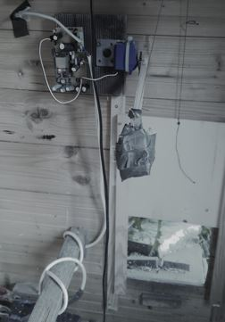
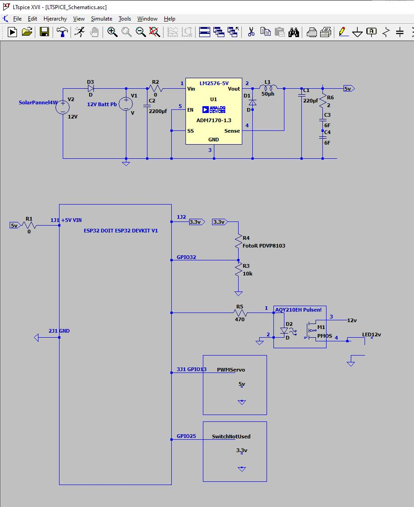

# ChickenDoor

This is a simple guide to build a DIY automated ChickenDoor.

# Project
The project is realized with an ESP32 and micropython.
- Used a foto resistor to detect night and day
- Used a servo motor out of a RC car
- 4W solar pannel to supply an old car battery
- Built a 5 V buck converter to supply the ESP32 with 5V 
- Used 5V Supercaps to supply the servo motor

# Mechanics

A weight optimized door with a counter weight is used.

An arm with the size radius, is mounted on the servo that moves 90°.

Bow = Lifting door Height
Bow = 2 * pi * Radius * (Alpha / 360°)

# Electronic 

# Firmware at Github

https://github.com/boschung/ChickenDoor

## Fix ESP32

Error: “Failed to connect to ESP32: Timed out waiting for packet header”
Use a 100uF between EN and GND
https://randomnerdtutorials.com/solved-failed-to-connect-to-esp32-timed-out-waiting-for-packet-header/

## Further implementations

Deepsleep Modes could reduce the power that is used.
Replace the foto sensor by an algorithm "time to position dependent day light". Time synchronisation could be done online.